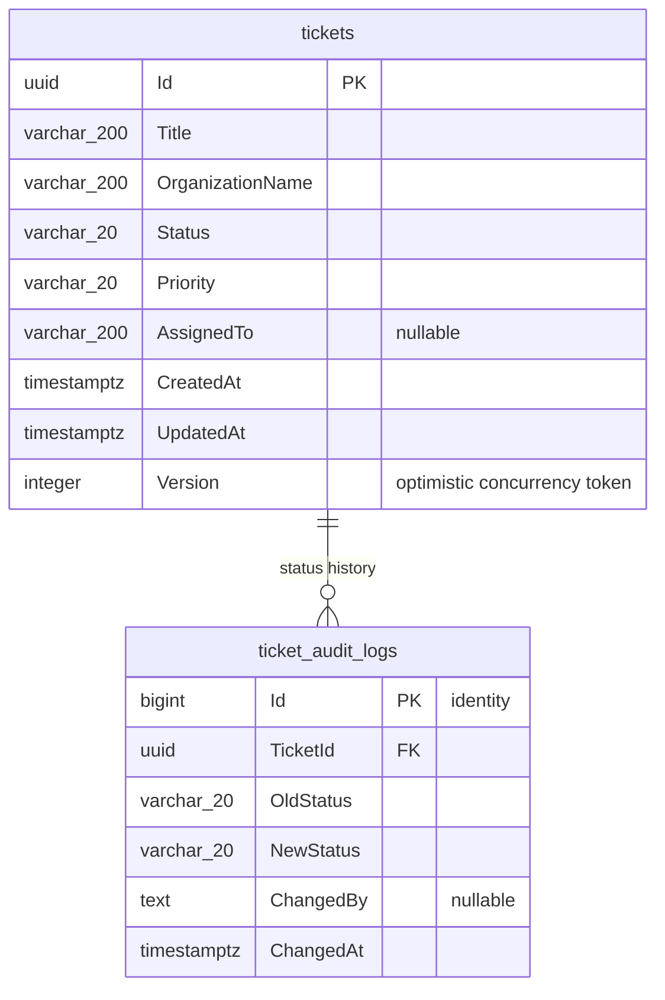

# מבנה מסד הנתונים

המסד הוא PostgreSQL. שמות הטבלאות באותיות קטנות; שמות העמודות נשמרים כפי שהוגדרו במודל EF Core. הסכמה נוצרת ומתעדכנת באמצעות מיגרציות בפרויקט `src/TicketManagement.Api/Data/Migrations`.

## תרשים קשרים

לכל פנייה יכולות להיות אפס או יותר רשומות היסטוריה. כל רשומת audit שייכת לפנייה אחת דרך `TicketId`; מחיקת פנייה מוחקת את רשומות ההיסטוריה שלה (`ON DELETE CASCADE`).

## `tickets`

| עמודה | טיפוס PostgreSQL | Nullable | משמעות |
| --- | --- | --- | --- |
| `Id` | `uuid` | לא | מפתח ראשי; נוצר כאובייקט `Guid` ביישום. |
| `Title` | `varchar(200)` | לא | כותרת הפנייה. |
| `OrganizationName` | `varchar(200)` | לא | שם הארגון. |
| `Status` | `varchar(20)` | לא | ערכי enum: `New`, `InProgress`, `Waiting`, `Completed`; נשמר כמחרוזת. |
| `Priority` | `varchar(20)` | לא | ערכי enum: `Low`, `Medium`, `High`; נשמר כמחרוזת. |
| `AssignedTo` | `varchar(200)` | כן | המטפל שהוקצה לפנייה. |
| `CreatedAt` | `timestamp with time zone` | לא | מועד יצירה ב־UTC. |
| `UpdatedAt` | `timestamp with time zone` | לא | מועד עדכון אחרון, נקבע בצד השרת. |
| `Version` | `integer` | לא | גרסת concurrency; מתחילה ב־1 ומוגדלת בעדכון מוצלח. |

ערכי ברירת המחדל של `Status`,‏ `Priority`, התאריכים, `Id` ו־`Version` נקבעים במודל/בשירות C#; למיגרציה אין `DEFAULT` מקביל במסד. כתיבה ישירה ל־DB צריכה לספק אותם במפורש.

## `ticket_audit_logs`

| עמודה | טיפוס PostgreSQL | Nullable | משמעות |
| --- | --- | --- | --- |
| `Id` | `bigint` identity | לא | מפתח ראשי, נוצר על ידי PostgreSQL. |
| `TicketId` | `uuid` | לא | מפתח זר אל `tickets.Id`. |
| `OldStatus` | `varchar(20)` | לא | סטטוס לפני השינוי; נשמר כמחרוזת enum. |
| `NewStatus` | `varchar(20)` | לא | סטטוס אחרי השינוי; נשמר כמחרוזת enum. |
| `ChangedBy` | `text` | כן | זהות המשתמש שביצע את השינוי; כרגע היישום אינו מאכלס אותו. |
| `ChangedAt` | `timestamp with time zone` | לא | זמן שינוי הסטטוס ב־UTC. |

רשומת audit נוצרת בעת עדכון סטטוס. הוספת רשומת ה־audit ועדכון הפנייה נשמרים יחד באותה פעולת `SaveChanges` של EF Core.

## מפתחות ואינדקסים

- `PK_tickets` על `tickets(Id)` – מפתח ראשי ושליפה לפי מזהה.
- `IX_tickets_Status` על `tickets(Status)` – סינון לפי סטטוס.
- `IX_tickets_Priority` על `tickets(Priority)` – סינון לפי עדיפות.
- `IX_tickets_AssignedTo` על `tickets(AssignedTo)` – סינון לפי מטפל.
- `IX_tickets_CreatedAt` על `tickets(CreatedAt)` – מיון לפי מועד יצירה.
- `IX_tickets_Status_Priority_CreatedAt` על `(Status, Priority, CreatedAt)` – סינון משולב ומיון לפי מועד יצירה.
- `PK_ticket_audit_logs` על `ticket_audit_logs(Id)` – מפתח ראשי.
- `IX_ticket_audit_logs_TicketId_ChangedAt` על `(TicketId, ChangedAt)` – שליפת היסטוריה לפנייה ומיון לפי זמן.
- `FK_ticket_audit_logs_tickets_TicketId` מקשר את יומן השינויים לפנייה ומוחק היסטוריה במחיקה מדורגת.

האינדקסים אינם מבטיחים שכל שאילתה תשתמש בהם; יש לאמת בחירת אינדקס באמצעות `EXPLAIN (ANALYZE, BUFFERS)`. בפרט, אינדקסי B-tree הקיימים אינם מתאימים היטב לחיפוש `ILIKE '%term%'`.

## מקור האמת

הסכמה המתועדת נגזרת מ־`AppDbContext` ומהמיגרציה `20260924181904_InitialCreate`. במקרה של פער, מיגרציות EF Core והסכמה החיה הן מקור האמת, ויש לעדכן מסמך זה בהתאם.
