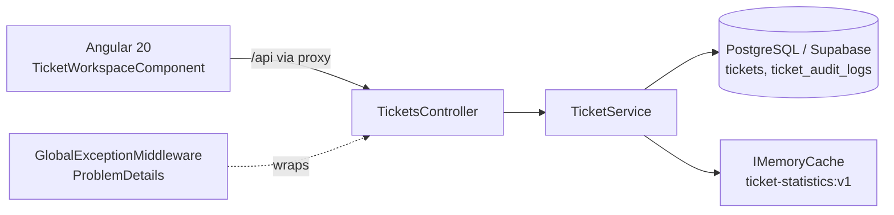

# Interview Guide – Ticket Management (Full Stack, Level C)

Prepared from `Doc/specs.docx` and the actual code in this repo. Each claim below is tied to a file you can open during the interview.

## 1. 60-second pitch

> A ticket-management system for many concurrent users and a large data set. **.NET 10 Web API** (controllers → service → EF Core) on **PostgreSQL/Supabase**, and an **Angular 20** client. All filtering, search, sorting and paging run in the database. Status updates use **optimistic concurrency** (a `Version` column checked in the SQL `UPDATE`). Every status change writes an **audit row in the same transaction**. Statistics are **cached** with explicit invalidation. Four integration tests run against the real HTTP pipeline. I measured two endpoints on 100,000 rows with `EXPLAIN (ANALYZE, BUFFERS)`.

## 2. Architecture



| Area | Path |
|---|---|
| Endpoints | `src/TicketManagement.Api/Controllers/TicketsController.cs` |
| Logic (queries, transitions, concurrency, audit, bulk, cache) | `Services/TicketService.cs`, `Services/TicketStatusTransitions.cs` |
| Model, indexes, concurrency token | `Data/AppDbContext.cs`, `Data/Migrations` |
| Error mapping | `Middleware/GlobalExceptionMiddleware.cs`, `Exceptions/*` |
| DTOs / query params | `Dtos/*` |
| Angular UI | `src/TicketManagement.Web/src/app` (component, `ticket-api.service.ts`, `ticket.models.ts`) |
| Tests | `tests/TicketManagement.Api.IntegrationTests` |
| Docs | `Doc/Section-6-Performance.md`, `Section-7-Cache.md`, `Section-8-Tests.md`, `Section-11-Solution.md`, `Database-Schema.md` |

## 3. Spec → implementation map

| Spec section | What exists | Say this |
|---|---|---|
| **1. Retrieval** | `GET /api/tickets`: server-side paging (max 100), filter by status, priority, assignedTo, `ILIKE` search on Title and OrganizationName, 5 sort fields with `Id` tie-break, `AsNoTracking`, DTOs, `CancellationToken`. Aggregations: `GET /api/tickets/statistics` (by status, by priority). | "The query stays `IQueryable`. EF translates it to SQL, so only one page is materialized. A separate `COUNT` provides `totalCount`." |
| **2. Status and concurrency** | 404 for missing ticket, state machine in `TicketStatusTransitions`, `Version` as EF concurrency token, `UpdatedAt` and `Version` set server-side. | "The client sends the version it saw. EF adds `WHERE Version = @orig` to the `UPDATE`. Zero rows affected → `DbUpdateConcurrencyException` → 409. Two competing writers cannot both win, so there is no lost update." |
| **3. Audit** | `ticket_audit_logs` (OldStatus, NewStatus, ChangedBy, ChangedAt), written in the same `SaveChanges` as the status change. `GET /api/tickets/{id}/history`. | "One `SaveChanges` is one DB transaction, so the status and its audit row are atomic." |
| **4. Bulk** | `POST /api/tickets/bulk-status`, max 100 (400 above that), **partial success**, per-item result. | See 4.4 for the justification. |
| **5. Angular** | Server-side search/filter/sort/paging, 350 ms debounce, `switchMap`/`takeUntil` cancellation, loading/empty/error states, status update with 409 handling, statistics, history panel. | See 4.7. |
| **6. Performance** | Two endpoints measured on 100k rows, indexes listed, bottleneck identified. | See 4.5. |
| **7. Cache** | `IMemoryCache`, key `ticket-statistics:v1`, 1 minute absolute TTL, removed on create/update. Multi-instance plan: Redis. | See 4.6. |
| **8. Tests** | 4 integration tests with `WebApplicationFactory` and in-memory SQLite. | See 4.8. |
| **9. Work plan** | Not found in the repo. | **Must prepare before the interview.** See section 8. |
| **10. Code quality** | Layering, DI, DTOs, async, global ProblemDetails handling. | Also admit that logging is minimal. |
| **11. Docs** | `Doc/Section-11-Solution.md` (setup, versions, decisions, AI usage). | Open it during the demo. |

## 4. Deep dives

### 4.1 Pagination, search and indexes
- Filters build up on one `IQueryable<Ticket>`. `Count`, `OrderBy`, `Skip`, `Take` and `Select` all run in PostgreSQL.
- `ThenBy(Id)` gives a deterministic order, so rows don't repeat or vanish between pages.
- Indexes (`AppDbContext`): `Status`, `Priority`, `AssignedTo`, `CreatedAt`, composite `(Status, Priority, CreatedAt)` for the common filter + date sort, and `ticket_audit_logs(TicketId, ChangedAt)` for history.
- **Weak spot:** `ILIKE '%term%'` cannot use B-tree indexes. The fix is the `pg_trgm` extension with a GIN index, to be adopted only after `EXPLAIN` shows it is needed.
- **Why offset paging:** simple, and it supports "jump to page N". Its cost grows with depth, so the alternative is keyset pagination.

### 4.2 Optimistic concurrency
```
Client A reads v=3     Client B reads v=3
A: UPDATE ... WHERE Id=x AND Version=3  → 1 row, Version=4
B: UPDATE ... WHERE Id=x AND Version=3  → 0 rows → 409
```
- Code: `db.Entry(ticket).Property(t => t.Version).OriginalValue = request.Version`, then `ticket.Version++`.
- The check is enforced **in the database statement**, not in the UI, which is what the spec asks for.
- Why optimistic: low contention, no long-held locks, and the UI can show a friendly conflict message.
- Alternatives: pessimistic locks (hold DB resources), last-write-wins (silent lost updates), PostgreSQL `xmin` as a built-in row version.
- The `Version` is an `int` incremented in app code. An `xmin` or `RowVersion` is the "more native" option. Be ready to say why you didn't use it: portability and simplicity, and it is testable on SQLite.

### 4.3 Audit
- Each successful status change adds a `TicketAuditLog` before the single `SaveChangesAsync`, so both rows commit or neither does.
- History is returned newest first, after an existence check (404 if the ticket is missing).

### 4.4 Bulk update – partial success
- **Decision:** partial success with a per-item result (`TicketId`, `Success`, `Error`).
- **Why:** items are independent tickets. One missing ticket, one invalid transition or one stale version shouldn't block 99 valid updates. The client gets exactly what failed and why.
- **When all-or-nothing is better:** operations that must be atomic as a business unit (for example, moving a whole case together). It also needs a stronger conflict policy.
- Hard limit: more than 100 items returns 400 before any processing.
- **Known risk (see section 6):** items are processed sequentially through the same `DbContext`.

### 4.5 Performance (from `Doc/Section-6-Performance.md`)
- Data: 100,000 tickets and 100,000 audit rows (`Doc/section-6-performance.sql`, with an empty-table guard so it never deletes data).
- Endpoints measured: `GET /api/tickets` (status + priority, page of 20) and `GET /api/tickets/{id}/history`.

| Step | SQL time | Plan |
|---|---|---|
| List – count (8,333 matches) | 2.954 ms | Index Only Scan, 77 buffer hits |
| List – page of 20 | 0.102 ms | Index Scan + Incremental Sort |
| History – existence check | 0.048 ms | Index Only Scan |
| History – audit fetch | 0.036 ms | Index Scan |

- HTTP median was about 467 ms for both endpoints, with p95 under 476 ms. That is dominated by round-trips from a local machine to Supabase and by the two sequential queries on the list endpoint. Say this clearly, so you aren't blamed for a "slow" API when SQL took under 3 ms.
- Bottlenecks to name: substring search, `COUNT` over every match on every request, deep `OFFSET`, and statistics scans as the table grows.

### 4.6 Cache
- **What:** statistics (two `GROUP BY` queries). They are read often by the dashboard and change only on create or status change.
- **Expiration:** 1 minute absolute. This is the safety net if data changes outside the API.
- **Invalidation:** `cache.Remove(key)` after a successful create or update (bulk goes through the same method). A failed update doesn't invalidate.
- **Multiple instances:** `IMemoryCache` is per process, so instance A invalidating does nothing for instance B. Use `IDistributedCache` with Redis under the same key, deleting the shared key after writes. If you add a local L1 cache on top, broadcast invalidation (Redis Pub/Sub).
- Why not cache tickets themselves: they change often and are cheap to fetch by primary key.

### 4.7 Angular
- `TicketWorkspaceComponent` uses signals for state and RxJS for the async flows.
- **Search:** `valueChanges → distinctUntilChanged → (cancel in-flight request) → debounceTime(350) → refresh`. The list stream uses `switchMap`, and `takeUntil(cancelListRequest$)` cancels a request when the user types again.
- **States:** `loading`, `listError`, empty (no results) and data.
- **Status update:** only transitions allowed by `nextStatuses` are offered. A 409 shows a message and refreshes the list. The `version` is sent with each update.
- **Cleanup:** `takeUntilDestroyed` on all long-lived subscriptions.
- `ticket-api.service.ts` is the only place that does HTTP. `proxy.conf.json` forwards `/api` to `http://localhost:5123`, so no CORS setup is needed in development.
- **Weak spots:** one large component (the spec asks to separate responsibilities between components and services). There is no bulk UI. The 409 message doesn't distinguish "stale version" from "invalid transition". Hebrew labels are hard-coded rather than i18n.

### 4.8 Tests
1. `GetTickets_FiltersBeforePaging` – happy path.
2. `GetTickets_ReturnsBadRequestForInvalidPage` – validation (400).
3. `UpdateStatus_WritesAuditAndInvalidatesStatisticsCache` – update + audit + cache.
4. `UpdateStatus_ReturnsConflictForStaleVersion` – concurrency (409).

All go through the real HTTP pipeline with in-memory SQLite and a fresh database per test. SQLite can't prove PostgreSQL-specific behavior (`ILIKE`, query plans). The fix is Testcontainers with PostgreSQL. A true concurrent race test (two parallel requests) is a good addition.

## 5. Two technology decisions with alternatives

| Decision | Chosen | Alternatives considered | Why |
|---|---|---|---|
| Database access | PostgreSQL (Supabase) via EF Core + Npgsql | Supabase REST/SDK with API key; MongoDB | Relational model (ticket ↔ audit), real transactions, SQL aggregations and indexes. The Supabase SDK adds nothing for plain SQL. |
| Concurrency | Optimistic with `Version` | Last-write-wins; pessimistic locks | Low contention, no held locks, an enforceable DB-level check. |

## 6. Known limitations – know these before they ask

Ranked by how likely an interviewer is to find them:

1. **Spec gaps in filtering:** the spec lists OrganizationName and a date range as filters; the API has neither. Easy to add.
2. **Audit fields:** the spec asks for `RequestId` and `PreviousStatus`. The code has `OldStatus` (same meaning) but no `RequestId`, and `ChangedBy` is always null because there is no authentication or user context.
3. **Bulk and the change tracker:** after one item hits a concurrency conflict, its modified entity stays tracked in the shared `DbContext`. The next item's `SaveChanges` may re-attempt it and fail wrongly. Fix: `db.ChangeTracker.Clear()` in the catch, or a fresh scope or context per item. Also add a regression test. This is the first thing to verify by running a bulk request with a stale version followed by a valid item.
4. **Invalid transition → 409:** defensible, but many reviewers expect 400 or 422 for a validation error and keep 409 for concurrency.
5. **Page size is clamped silently** rather than rejected. The spec says "validation".
6. **Input validation on create:** no explicit length or required rules on `CreateTicketRequest`; only DB column limits.
7. **Logging:** only the global exception middleware logs. No logs for key operations.
8. **Bulk performance:** N sequential round-trips (about 3 queries per item). Batch with `WHERE Id IN (...)` in one query if volume grows.
9. **No work-plan document** (spec section 9) in the repo.

"One limitation + one improvement" is required in the docs. Strong choices: the substring-search index (`pg_trgm`) and the Redis cache for multi-instance.

## 7. Likely questions and model answers

**Why is the first load of a page not O(N)?** Because `Where/OrderBy/Skip/Take` stay in `IQueryable` and become SQL. Only 20 rows are materialized, and the plan uses indexes.

**What happens if two users change the same ticket?** The first `UPDATE ... WHERE Version = x` wins and increments the version. The second affects 0 rows, gets a 409, and the UI refreshes and tells the user.

**Why not handle concurrency only in the UI?** The UI can't see other users' writes. Only the database can atomically enforce it.

**Is the cache correct after an update?** Yes on a single instance: `Remove` on success, and a 1-minute TTL as a bound. With several instances it is only eventually consistent (up to 1 minute) until moved to Redis.

**Why partial success for bulk?** Items are independent and the client needs per-item results. All-or-nothing would turn one bad item into a total failure.

**How would you prove the index helps?** Run `EXPLAIN (ANALYZE, BUFFERS)` before and after, and compare plan node, time and buffers. That is what Section 6 does.

**What would you do for 10× traffic?** Read replicas, keyset pagination, cached or materialized counts, Redis cache, `pg_trgm` for search, and rate limits on bulk.

**How do you avoid N+1 or tracking overhead?** `AsNoTracking` on reads, projection to DTOs, and one query per page plus one count.

**Why DTOs and not entities?** The API contract is decoupled from the schema, and the server controls `Version` and `UpdatedAt`.

**Which parts used AI?** Docs for sections 6–8 and 11, the cache, the integration tests, and scaffolding. Core logic (sections 1–4) was reviewed and tested by hand. Be specific about what you changed or rejected. Section 11 of the docs includes this statement.

**Security note you should raise yourself:** the DB password is kept in user-secrets or environment variables (`ConnectionStrings__Supabase`), never in `appsettings.json` or Git. Rotate any credential that was ever pasted into chat or logs.

## 8. Work plan (section 9) – prepare this

Suggested breakdown mapped to the spec, to present on a single page:

| # | Task | Spec | Depends on | Estimate |
|---|---|---|---|---|
| 1 | Data model, enums, DB choice, migration | 1–3 | – | 0.5 d |
| 2 | Indexes + 100k seed script (repeatable) | 1, 6 | 1 | 0.5 d |
| 3 | List endpoint: paging, filters, search, sort, aggregations | 1 | 1 | 1 d |
| 4 | Status update: transitions, 404/409, concurrency | 2 | 1 | 1 d |
| 5 | Audit + history endpoint | 3 | 4 | 0.5 d |
| 6 | Bulk endpoint, behavior documented | 4 | 4, 5 | 0.5 d |
| 7 | Global error handling (ProblemDetails), logging | 10 | 3–6 | 0.5 d |
| 8 | Cache + invalidation + multi-instance note | 7 | 3, 4 | 0.5 d |
| 9 | Angular: service, list, states, debounce/switchMap | 5 | 3 | 1.5 d |
| 10 | Angular: status update, 409, history, statistics | 5 | 4, 5, 9 | 1 d |
| 11 | Integration tests (4+) | 8 | 3–5 | 1 d |
| 12 | Performance measurement and report | 6 | 2, 3 | 0.5 d |
| 13 | Documentation, run instructions, AI usage | 11 | all | 0.5 d |

Critical path: 1 → 4 → 5 → 10. Parallel streams after step 1: backend queries (3), UI skeleton (9), DB scripts (2).

## 9. Demo script (about 5 minutes)

1. `dotnet run --project src/TicketManagement.Api` and `npm start --prefix src/TicketManagement.Web`; open `http://localhost:4200`.
2. Type fast in search → show the single request (debounce + cancel) and results updating.
3. Filter by status + priority, change the sort field, and change page.
4. Change one ticket's status → show the statistics update (cache invalidation) and open its history.
5. Show the 409 case: open the same ticket in two tabs, update in one, then update in the other.
6. Show an invalid transition (for example Completed → New) → a clear error.
7. Open `Doc/Section-6-Performance.md` and one `EXPLAIN` result.
8. Run `dotnet test tests/TicketManagement.Api.IntegrationTests` and show 4 passing tests.

## 10. Checklist before the interview

- [ ] Add the OrganizationName and date-range filters (small change, closes a spec gap).
- [ ] Verify the bulk + conflict behavior (limitation 3) and fix it with `ChangeTracker.Clear()` plus a test.
- [ ] Add a short work-plan document (section 8 above).
- [ ] Run everything from a clean clone using only the README/Section 11 steps.
- [ ] Confirm no secrets are in Git history (`appsettings.json` has only a placeholder).
- [ ] Rotate the database password.
- [ ] Decide your answer on 409 vs 400 for invalid transitions and be ready to defend it.
