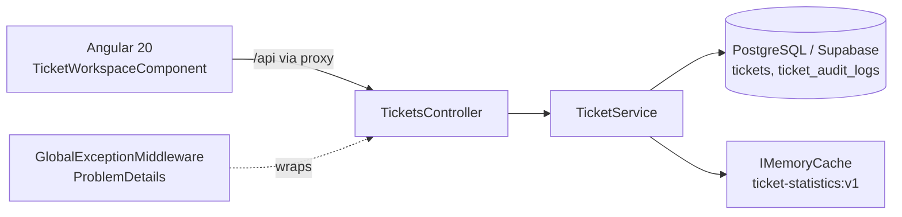

# Ticket Management

A ticket (request) management system for many concurrent users and a large data set: a **.NET 10 Web API** on **PostgreSQL (Supabase)** and an **Angular 20** client.

Users can search, filter, sort and page tickets on the server, update ticket status safely under concurrent edits, view the change history and see summary statistics.

## Features

- **Retrieval:** server-side paging (max 100 per page), combined filters, text search, sorting, aggregations. Nothing is filtered or paged on the client.
- **Status updates:** an explicit state machine, 404 for unknown tickets, and **optimistic concurrency** that returns 409 on conflict.
- **Audit:** every status change is recorded in the same transaction, with a history endpoint.
- **Bulk update:** up to 100 tickets per request, **partial success** with a per-item result.
- **Cache:** statistics are cached in memory with a TTL and explicit invalidation.
- **Errors:** consistent RFC 7807 `ProblemDetails` responses from one global middleware.

## Tech stack

| Part | Technology |
|---|---|
| Backend | ASP.NET Core Web API, .NET 10 (`net10.0`), controllers |
| Data access | Entity Framework Core 10.0.12, Npgsql provider 10.0.3 |
| Database | PostgreSQL hosted on Supabase |
| Frontend | Angular 20.3, Signals, Reactive Forms, RxJS 7.8 |
| Tests | xUnit, `WebApplicationFactory`, SQLite in-memory |

## Repository layout

```
src/
  TicketManagement.Api/        Web API
    Controllers/               HTTP endpoints
    Services/                  Queries, transitions, concurrency, audit, bulk, cache
    Data/                      AppDbContext, indexes, EF migrations
    Models/ Dtos/              Entities and request/response contracts
    Middleware/ Exceptions/    Global error handling
  TicketManagement.Web/        Angular client (dev proxy: /api -> http://localhost:5123)
tests/
  TicketManagement.Api.IntegrationTests/
Doc/                           Specs, performance, cache, tests, solution notes
```

### Architecture



## Requirements coverage

| Spec section | Implementation | Where |
|---|---|---|
| 1. Retrieval | Server-side paging, filters, `ILIKE` search, 5 sort fields, statistics aggregations, DTOs, `CancellationToken` | `TicketService.GetTicketsAsync`, `GetStatisticsAsync` |
| 2. Status and concurrency | Transition state machine, 404/409, `Version` concurrency token | `TicketStatusTransitions`, `TicketService.UpdateStatusAsync` |
| 3. Audit | Audit row in the same transaction, history endpoint | `TicketAuditLog`, `GET /{id}/history` |
| 4. Bulk | Up to 100 items, partial success, per-item result | `POST /bulk-status` |
| 5. Angular | Server-side search/filter/sort/paging, debounce, request cancellation, UI states, 409 handling, statistics, history | `src/TicketManagement.Web` |
| 6. Performance | Two endpoints measured on 100k rows | [Doc/Section-6-Performance.md](Doc/Section-6-Performance.md) |
| 7. Cache | In-memory statistics cache, TTL and invalidation, Redis plan for scale-out | [Doc/Section-7-Cache.md](Doc/Section-7-Cache.md) |
| 8. Tests | 4 integration tests | `tests/TicketManagement.Api.IntegrationTests` |
| 9. Work plan | See [Work plan](#work-plan) | this file |
| 10. Code quality | Layered structure, DI, DTOs, async, global `ProblemDetails` handling | `src/TicketManagement.Api` |
| 11. Documentation | This README and `Doc/` | [Doc/Section-11-Solution.md](Doc/Section-11-Solution.md) |

## Getting started

### Prerequisites

- .NET SDK 10
- Node.js and npm (Angular CLI 20 is installed by `npm install`)
- A PostgreSQL database, for example a Supabase project
- `dotnet-ef` 10.0.12: `dotnet tool install --global dotnet-ef --version 10.0.12`

### 1. Configure the database connection

Use an Npgsql connection string (host, port, database, user, password). Store it in user-secrets so it never reaches Git:

```powershell
dotnet user-secrets set "ConnectionStrings:Supabase" "<npgsql-connection-string>" --project src/TicketManagement.Api
```

When hosted, set the environment variable `ConnectionStrings__Supabase`. `appsettings.json` contains only a placeholder.

> EF Core connects with the database user and password. A Supabase REST API key is not used.

### 2. Create the schema

```powershell
dotnet ef database update --project src/TicketManagement.Api
```

### 3. Run the API

```powershell
dotnet run --project src/TicketManagement.Api
```

The API listens on `http://localhost:5123`. In Development the OpenAPI document is served at `/openapi/v1.json`.

### 4. Run the Angular client

```powershell
npm install --prefix src/TicketManagement.Web
npm start --prefix src/TicketManagement.Web
```

Open `http://localhost:4200`. The Angular dev proxy forwards `/api` to the API, so no CORS setup is needed in development.

### Test data

[Doc/section-6-performance.sql](Doc/section-6-performance.sql) inserts 100,000 tickets and 100,000 audit rows. It stops if the tables are not empty, so it never deletes existing data. Run it against a test database or schema.

### Tests

```powershell
dotnet test tests/TicketManagement.Api.IntegrationTests/TicketManagement.Api.IntegrationTests.csproj --configuration Release
```

Build the client:

```powershell
npm run build --prefix src/TicketManagement.Web
```

## API

Base path: `/api/tickets`

| Method | Route | Description |
|---|---|---|
| `GET` | `/` | List tickets with paging, filters, search and sorting |
| `GET` | `/statistics` | Counts by status and by priority (cached) |
| `GET` | `/{id}` | Get one ticket |
| `POST` | `/` | Create a ticket (status starts as `New`) |
| `PATCH` | `/{id}/status` | Change status; body `{ "newStatus": "...", "version": n }` |
| `POST` | `/bulk-status` | Update up to 100 tickets; returns a result per item |
| `GET` | `/{id}/history` | Status-change history, newest first |

**List query parameters:** `page`, `pageSize` (1–100, default 20), `status`, `priority`, `assignedTo`, `search` (Title and OrganizationName), `sortBy` (`CreatedAt`, `UpdatedAt`, `Priority`, `Title`, `Status`), `sortDescending`.

**Ticket fields:** `Id`, `Title`, `OrganizationName`, `Status` (`New`, `InProgress`, `Waiting`, `Completed`), `Priority` (`Low`, `Medium`, `High`), `AssignedTo`, `CreatedAt`, `UpdatedAt`, `Version`.

**Status transitions:** `New → InProgress`, `InProgress → Waiting | Completed`, `Waiting → InProgress | Completed`. `Completed` is final.

**Error responses** are `application/problem+json`:

| Case | Status |
|---|---|
| Ticket not found | 404 |
| Transition not allowed | 409 |
| Stale `version` (concurrent update) | 409 |
| Invalid parameters, or bulk request over 100 items | 400 |
| Unexpected error | 500 (generic message, details only in logs) |

## Design

### Data access and paging

Filters, sorting, `Skip`/`Take` and `COUNT` are composed on an `IQueryable` and translated to SQL, so only one page is loaded into memory. Reads use `AsNoTracking`, results are DTOs, and every I/O call takes a `CancellationToken`. Sorting adds `Id` as a tie-break so paging is stable.

Indexes (in `AppDbContext`): `Status`, `Priority`, `AssignedTo`, `CreatedAt`, composite `(Status, Priority, CreatedAt)`, and `ticket_audit_logs(TicketId, ChangedAt)`. See [Doc/Database-Schema.md](Doc/Database-Schema.md).

### Concurrency

`Ticket.Version` is an EF concurrency token. The client sends the version it last read; EF adds it to the `UPDATE ... WHERE Id = @id AND Version = @version` statement. If another writer got there first, no row matches and the API returns 409. The server increments `Version` and sets `UpdatedAt`; clients cannot set them. The check happens in the database, not only in the UI.

### Audit

The ticket change and its audit row are saved in one `SaveChangesAsync`, so they commit together or not at all.

### Bulk update

Partial success: each ticket is processed independently, and the response lists success or the reason for failure per item. A missing ticket, an invalid transition or a version conflict does not block the others. A request with more than 100 items is rejected with 400.

### Cache

`GET /api/tickets/statistics` is cached in `IMemoryCache` under `ticket-statistics:v1` with a 1-minute absolute expiration. The key is removed after every successful create or status update (bulk included). The TTL bounds staleness if data changes outside the API. `IMemoryCache` is per process; for several instances use `IDistributedCache` with Redis. Details: [Doc/Section-7-Cache.md](Doc/Section-7-Cache.md).

### Frontend

A signal-based workspace component with a single `TicketApiService` for HTTP. Search is debounced (350 ms) and in-flight list requests are cancelled when the query changes (`switchMap`). The UI has loading, empty and error states, status updates with 409 handling, statistics and a history panel.

## Performance

Measured on 100,000 tickets and 100,000 audit rows with `EXPLAIN (ANALYZE, BUFFERS)`:

| Query | SQL time |
|---|---|
| List: count (8,333 matches) | 2.954 ms |
| List: page of 20 | 0.102 ms |
| History: existence check | 0.048 ms |
| History: audit rows | 0.036 ms |

HTTP medians were about 467 ms, dominated by the network round-trip from a local machine to Supabase. Full method, plans and bottlenecks: [Doc/Section-6-Performance.md](Doc/Section-6-Performance.md).

## Testing

Four integration tests run the real HTTP pipeline (controllers, middleware, service, EF Core) against in-memory SQLite, with a fresh database per test:

1. Filtering is applied before paging.
2. An invalid page returns 400.
3. A status update writes an audit row and invalidates the statistics cache.
4. A stale version returns 409.

SQLite cannot verify PostgreSQL-specific behavior such as `ILIKE` or query plans. See [Doc/Section-8-Tests.md](Doc/Section-8-Tests.md).

## Key decisions

| Decision | Chosen | Alternatives |
|---|---|---|
| Database | PostgreSQL via EF Core and Npgsql | Supabase REST/SDK, MongoDB |
| Concurrency | Optimistic with `Version` | Last-write-wins, pessimistic locks |
| Bulk | Partial success | All-or-nothing transaction |
| Cache | In-memory with TTL and invalidation | Redis (needed for multiple instances) |

## Known limitations and next steps

- Text search uses `ILIKE '%term%'`, which cannot use the B-tree indexes. Next step: `pg_trgm` with a GIN index, after confirming with `EXPLAIN`.
- The in-memory cache is not shared between server instances. Next step: Redis.
- Filtering by organization name and by date range is not implemented yet.
- The audit log has no `RequestId`, and `ChangedBy` is empty because the API has no authentication yet.
- Bulk items run sequentially in one `DbContext`; after a conflict the change tracker should be cleared before the next item.
- Offset paging gets slower on deep pages; keyset paging is the alternative.

## Work plan

How the spec was split into tasks (estimates in days):

| # | Task | Spec | Depends on | Estimate |
|---|---|---|---|---|
| 1 | Data model, enums, DB choice, migration | 1–3 | – | 0.5 |
| 2 | Indexes and repeatable 100k seed script | 1, 6 | 1 | 0.5 |
| 3 | List endpoint: paging, filters, search, sort, aggregations | 1 | 1 | 1 |
| 4 | Status update: transitions, 404/409, concurrency | 2 | 1 | 1 |
| 5 | Audit and history endpoint | 3 | 4 | 0.5 |
| 6 | Bulk endpoint and documented behavior | 4 | 4, 5 | 0.5 |
| 7 | Global error handling (ProblemDetails) and logging | 10 | 3–6 | 0.5 |
| 8 | Cache, invalidation and multi-instance note | 7 | 3, 4 | 0.5 |
| 9 | Angular: service, list, UI states, debounce and cancellation | 5 | 3 | 1.5 |
| 10 | Angular: status update, 409, history, statistics | 5 | 4, 5, 9 | 1 |
| 11 | Integration tests (4+) | 8 | 3–5 | 1 |
| 12 | Performance measurement and report | 6 | 2, 3 | 0.5 |
| 13 | Documentation, run instructions, AI usage | 11 | all | 0.5 |

Critical path: 1 → 4 → 5 → 10. After task 1, the backend queries (3), the UI skeleton (9) and the DB scripts (2) can proceed in parallel.

## Documentation

- [Doc/Section-11-Solution.md](Doc/Section-11-Solution.md): setup, versions, decisions, AI usage
- [Doc/Database-Schema.md](Doc/Database-Schema.md)
- [Doc/Section-6-Performance.md](Doc/Section-6-Performance.md)
- [Doc/Section-7-Cache.md](Doc/Section-7-Cache.md)
- [Doc/Section-8-Tests.md](Doc/Section-8-Tests.md)
- [Doc/Interview-Guide.md](Doc/Interview-Guide.md) and [Doc/Interview-QA.md](Doc/Interview-QA.md)

## Use of AI

GitHub Copilot was used for scaffolding, the documentation sections, the cache and the integration test project. The core logic was reviewed and run manually, and the author is responsible for all submitted code.
